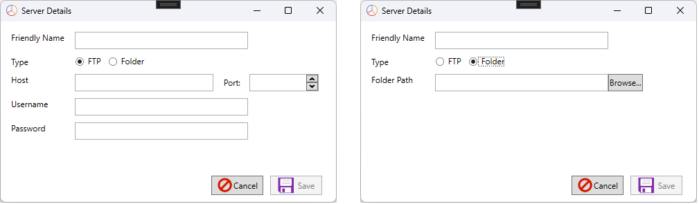

# ACC Server Results Companion

ACC Server Results Companion is an application that imports the session result files created by ACC Server. I can connect remotely via FTP or to a local folder where the files have been downloaded or created by a local instance of ACC Server.

The data from the result files is imported into a local database and presented in various views with the ability to export to CSV or Excel.

The latest release can be found [here](https://github.com/testpossessed/acc-server-results-companion/releases). Simply download and run ACCServerResultsCompanionSetup.exe.
The application will install then launch automatically Each time the application is started it will automatically update to the latest version before launching.

## Getting Started

Once the applicaiton is installed you will need to add a Server, follow these steps to do so.

Click the first button in the toolbar 

Select either FTP or Folder as the Type of server

Enter the details for the Type.

Friendly name must be completed for both Types

For FTP, Host and Port must be provided.

For Folder, an absolute path must be entered or selected using the Browse... button.

The Save button will not be enabled until the required information is correctly entered.

Click Save when enabled and the new server will be added to the list labelled Servers in the toolbar and any result files that contain laps driven will be imported and a list of session will be displayed in the left panel.  Selecting a session in this panel will update the views in the right panel.

PLEASE NOTE:  This application and documentation is in the early stages of development so it will change frequently.
